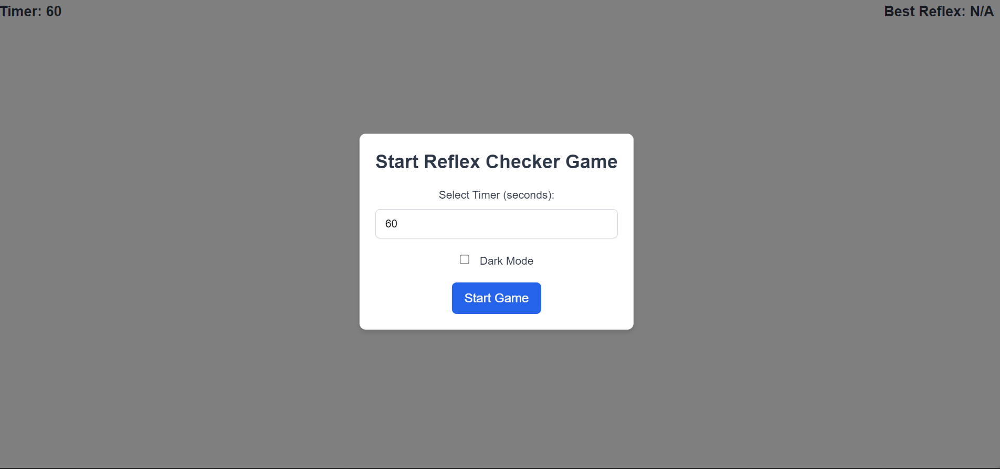
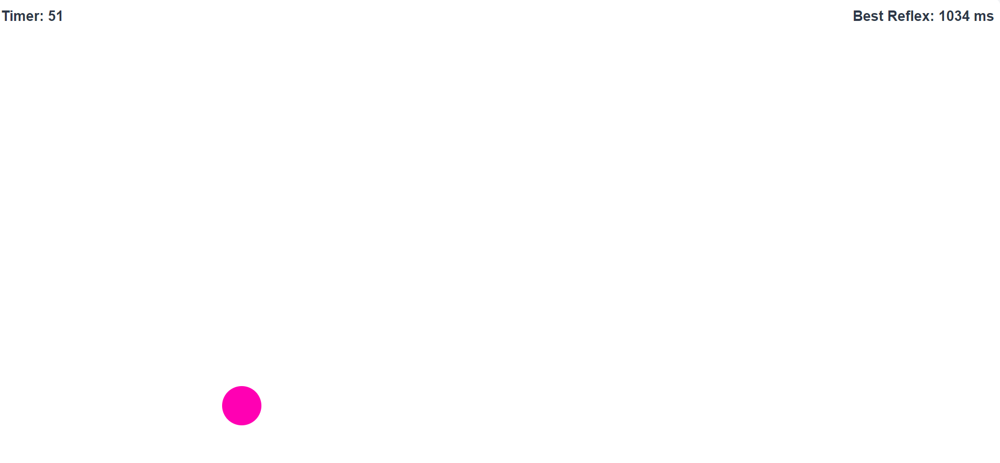
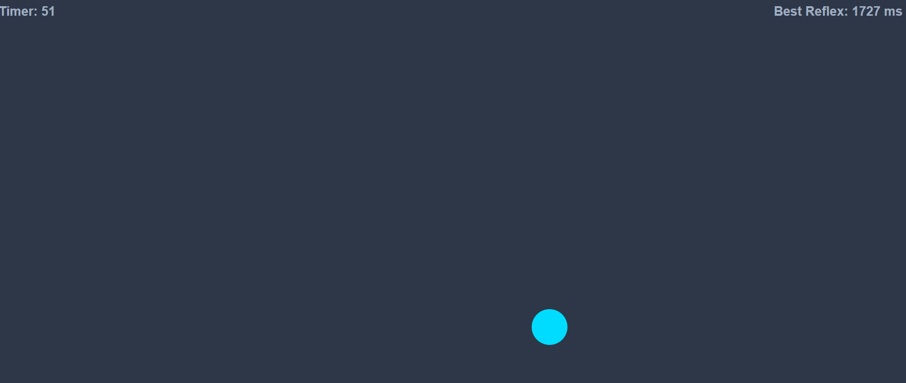
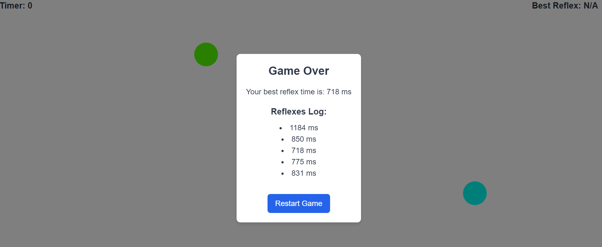

# Reflex Checker Game

Reflex Checker Game is a fun and interactive game to test your reflexes. Click on the colorful balls as quickly as possible and aim for the best reaction time. The game also features light and dark mode themes.

## Features
- Start the game with a customizable timer.
- Toggle between light and dark themes.
- Colorful balls that appear randomly on the screen.
- Track your best reflex time.
- View a log of all your reflex times at the end of the game.

## Getting Started
These instructions will get you a copy of the project up and running on your local machine for development and testing purposes.

### Prerequisites
- A modern web browser (Chrome, Firefox, Safari, Edge)
- A text editor or IDE (VS Code, Sublime Text, Atom, etc.)

### Installation
1. Clone the repository:
    ```sh
    git clone https://github.com/yourusername/reflex-checker-game.git
    ```
2. Navigate to the project directory:
    ```sh
    cd reflex-checker-game
    ```
3. Open the `index.html` file in your web browser:
    ```sh
    open index.html
    ```

### Usage
1. **Start the Game**: Upon loading the game, you will see a popup to start the game. You can select the timer duration and toggle between light and dark themes.


2. **Start Game in Light Mode**: Click on the "Start Game" button to begin. Colorful balls will appear randomly on the screen.


3. **Start Game in Dark Mode**: Toggle the dark mode checkbox before starting the game.


4. **Game Score**: Click on the balls as quickly as possible. The best reflex time will be tracked and displayed. When the timer ends, you will see a game over popup with your best reflex time and a log of all your reflex times.


### Files
- `index.html`: The main HTML file that contains the structure of the game.
- `style.css`: The CSS file that contains the styles for the game, including themes.
- `app.js`: The JavaScript file that contains the game logic.

### Contributing
1. Fork the repository.
2. Create your feature branch (`git checkout -b feature/AmazingFeature`).
3. Commit your changes (`git commit -m 'Add some AmazingFeature'`).
4. Push to the branch (`git push origin feature/AmazingFeature`).
5. Open a pull request.

### License
This project is licensed under the MIT License - see the [LICENSE.md](LICENSE.md) file for details.

### Acknowledgments
- [Tailwind CSS](https://tailwindcss.com/)
- [Font Awesome](https://fontawesome.com/)

### Contact
Your Name - [sundarsharama469@gmail.com](mailto:your.email@example.com)

Project Link: [https://github.com/sundarsharma332/BrowserGames/tree/main/reflex-checker](https://github.com/yourusername/reflex-checker-game)
